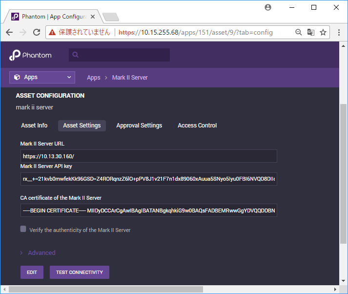

## **Preparations**

Mark II Server App needs an API key to post requests from Phantom to Mark II Server.  
  
The key can be obtained from the Mark II Server WebUI:  
System → Server → Common Settings → SIEM  
  
  
In addition, Mark II Server provides a Certificate Authority (CA) certificate to verify the
authenticity of the Mark II Server.  
  
The certificate can be downloaded from the Mark II Server WebUI:  
System → Certificates → Private CA → Download  
  

## **Phantom Mark II Server Asset**

Fill out the required values in the Asset Info tab.  
  
  
Fill out and check the Asset Settings tab.  
  
  

| FIELD                                         | DESCRIPTION                                                                                                               |
|-----------------------------------------------|---------------------------------------------------------------------------------------------------------------------------|
| Mark II Server URL                            | e.g., "https://192.168.0.1/". Mark II Server listens on HTTPS by default                                                  |
| Mark II Server API Key                        | An API Key obtained from the Mark II Server                                                                               |
| CA Certificate of the Mark II Server          | A CA Certificate obtained from the Mark II Server                                                                         |
| Verify the authenticity of the Mark II Server | Check this if you want to verify the authenticity of the Mark II Server with the CA certificate filled in the above field |

  

## **Test Connectivity**

To test the connectivity between Phantom and Mark II Server, click the "TEST CONNECTIVITY" button in
the Asset Settings tab, which will display a text box with progress messages.  
  

